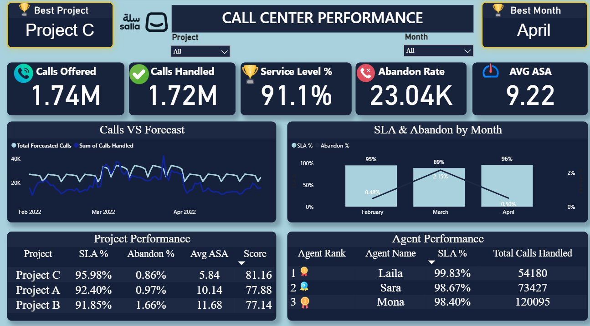

# 📞 Salla Call Center Dashboard

A **Power BI** dashboard for analyzing call center performance across multiple projects, built on real operational data (Feb–Apr 2022) covering agent activity, call handling efficiency, and service level metrics.

---

## 📸 Dashboard Preview



---

## 🛠️ Tools Used

| Tool | Purpose |
|------|---------|
| Power BI Desktop | Dashboard & visualizations |
| CSV | Raw data source |
| DAX | Calculated measures & KPIs |

---

## 📁 Repository Structure

```
Salla-Call-Center-Dashboard/
│
├── Salla_Project.pbix          # Power BI dashboard file
├── Sallah_Call_Center_DB.csv   # Dataset (267 records)
├── dashboard_preview.png       # Dashboard screenshot
└── README.md                   # Project documentation
```

---

## 📊 Dataset Overview

**Records:** 267 rows | **Period:** Feb – Apr 2022  
**Projects:** Project A, Project B, Project C

### Columns

| Column | Description |
|--------|-------------|
| `Project` | Project/team name |
| `Date` | Date of the record |
| `Month` | Month label |
| `Forecasted Calls` | Expected call volume |
| `Calls Offered` | Total calls received |
| `Calls Handled` | Calls successfully answered |
| `Calls Handled Within Threshold` | Calls answered within SLA time |
| `Calls Abandon` | Calls dropped before being answered |
| `ASA` | Average Speed of Answer (seconds) |
| `Answer Time` | Total answer time |
| `Agent Name` | Handling agent |

---

## 📈 Key KPIs & Insights

| KPI | Value |
|-----|-------|
| 📞 Calls Offered | 1.74M |
| ✅ Calls Handled | 1.72M |
| 🏆 Service Level % | 91.1% |
| ❌ Abandon Rate | 23.04K |
| ⏱️ AVG ASA | 9.22 sec |

### 🥇 Best Project → **Project C** (SLA: 95.98% | Score: 81.16)
### 🥇 Best Month → **April** (SLA: 96% | Abandon: 0.50%)

### 🏅 Top Agents
| Rank | Agent | SLA % | Calls Handled |
|------|-------|-------|---------------|
| 🥇 1 | Laila | 99.83% | 54,180 |
| 🥈 2 | Sara | 98.67% | 73,427 |
| 🥉 3 | Mona | 98.40% | 120,095 |

---

## 🚀 How to Use

1. Clone or download this repository
2. Open `Salla_Project.pbix` in **Power BI Desktop**
3. If prompted, update the data source path to point to `Sallah_Call_Center_DB.csv`
4. Refresh the data and explore the dashboard

> ⚠️ **Note:** Power BI Desktop is required to open `.pbix` files. Download it free from [Microsoft](https://powerbi.microsoft.com/desktop/).

---

## 👨‍💻 Author

**Samy Mohamed Alnajy**  
Data Analyst | Computer Science & AI Student  
📧 Connect on [LinkedIn](#) <!-- Add your LinkedIn URL here -->
